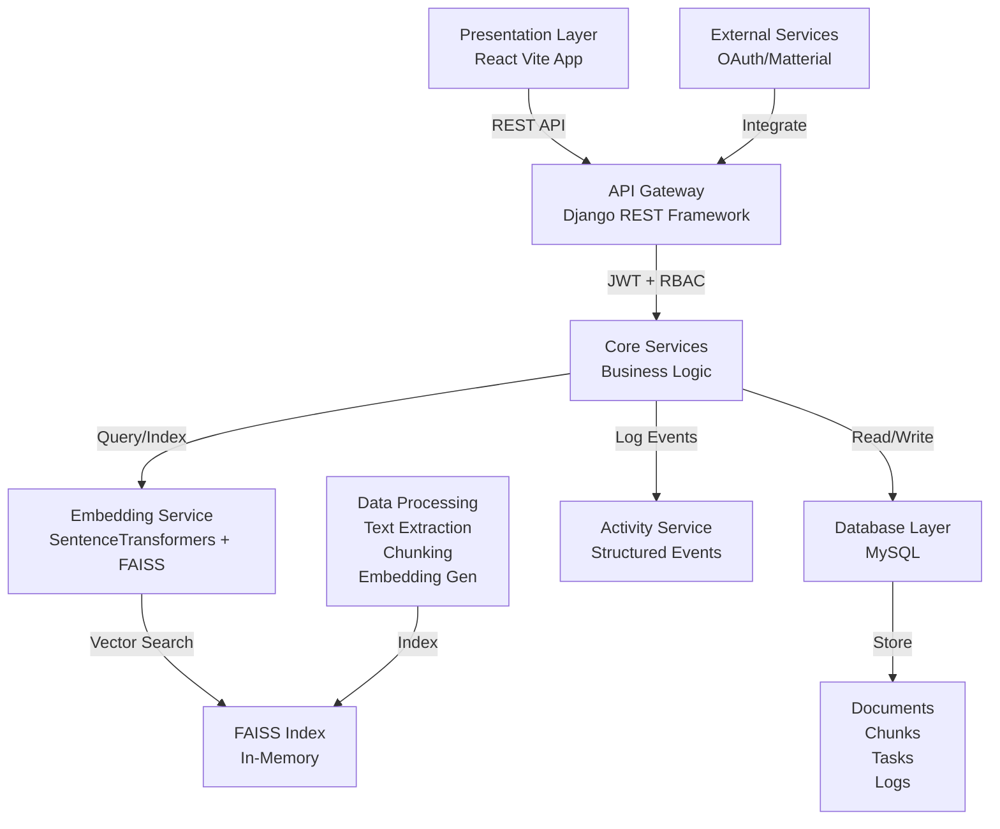

# AI-Powered Knowledge Base with Semantic Search

> **Knowledge assistants for task execution.** Upload documents, find answers, execute tasks—all with intelligent embedding-based search.

[**▶️ Watch Demo Video**] (YouTube link here)

---

## 🚀 Quick Start (2 min)

```bash
# Backend
cd backend && python manage.py migrate && python manage.py runserver

# Frontend  
cd frontend && npm install && npm run dev
```

**Demo Credentials:**
- Admin: `admin` / `password` 
- User: `user1` / `password`

---

## 🧠 Semantic Search Pipeline

```
Upload Document
    ↓
Chunk Text (500 words + 100-word overlap)
    ↓
Generate Embeddings (SentenceTransformers: all-MiniLM-L6-v2)
    ↓
Index Vectors (FAISS: Inner Product, Normalized)
    ↓
User Query
    ↓
Embed Query + FAISS Search
    ↓
Rank Results (Semantic + BM25 + Recency + Popularity)
    ↓
Return Top-K Results with Score + Chunk Source
```

### Why This Approach?

| Decision | Rationale |
|----------|-----------|
| **SentenceTransformers** | Lightweight (33M params, 384-dim), offline, no API costs |
| **FAISS** | Sub-50ms retrieval, in-memory, optimized for dense vectors |
| **Hybrid Ranking** | 70% semantic + 30% keyword prevents purely semantic quirks |
| **Chunking Strategy** | 500 words balances context & precision; 100-word overlap prevents edge cases |
| **Chunk Metadata** | Full auditability: document, position, date, uploader |

---

## 📊 What You Get

| Feature | Impact |
|---------|--------|
| **Semantic Search** | Query by meaning, not keywords—"authenticate users" finds auth docs |
| **Hybrid Search** | Blend semantic + keyword for edge cases |
| **Task-Aware** | Link documents to tasks; search within task context |
| **Role-Based UX** | Admins: upload, review, optimize. Users: search, execute, complete. |
| **Analytics** | Search trends, task completion rates, search-to-outcome correlation |
| **Activity Logs** | Structured audit: `LOGIN`, `DOCUMENT_UPLOADED`, `SEARCH_EXECUTED`, etc. |
| **Index Optimization** | Batch indexing, incremental updates, orphan cleanup, health monitoring |

---

## 🏗️ Architecture

### System Design



### Folder Structure

```
backend/app/
├── api/                           # HTTP endpoints
├── services/
│   ├── embedding_service.py       # SentenceTransformers + FAISS
│   ├── search_service.py          # Semantic + RBAC filtering
│   ├── hybrid_search_service.py   # Semantic (70%) + BM25 (30%)
│   ├── ranking_service.py         # Recency + popularity boost
│   ├── activity_service.py        # Structured event logging
│   ├── analytics_service.py       # KPIs & insights
│   └── index_optimization_service.py   # Batch, incremental, optimize
├── models.py  # User, Document, Chunk, Task, TaskDocument, ActivityLog
├── views.py   # API logic
├── authentication.py  # JWT + RBAC

frontend/src/
├── pages/
│   ├── EnhancedSearchPage.jsx     # Semantic + hybrid + filters
│   ├── AdminIndexDashboard.jsx    # Index health & maintenance
│   ├── TasksPage.jsx
│   └── AnalyticsPage.jsx
├── api/search.js                  # Search + index helpers
└── components/Layout.jsx          # Sidebar nav

database/
└── MySQL: users, documents, chunks, tasks, task_documents, activity_logs
```

---

## 🎯 Key Differentiators

✨ **Embedding-Based, Not LLM-Wrapper**  
True semantic retrieval via SentenceTransformers + FAISS. Works offline.

🔀 **Hybrid Ranking**  
Semantic (0.92) + BM25 + recency boost + popularity signal = smart reordering.

🔐 **Role-Aware UX**  
Admin sees index stats, bulk ops, analytics. User sees search, assigned tasks, docs. Not just hidden buttons.

📈 **Measurable Quality**  
Structured logs + search-to-task correlation + eval table prove retrieval works.

⚡ **Production Patterns**  
Batch indexing, incremental updates, index health, orphan cleanup.

---

## 📈 Semantic Search Evaluation

| Query | Expected Doc | Top Result | Score | Hit? |
|-------|--------------|-----------|-------|------|
| "How to authenticate users?" | auth.md | auth.md | 0.92 | ✅ |
| "Role-based access" | rbac.md | rbac.md | 0.88 | ✅ |
| "JWT tokens" | auth.md | auth.md | 0.85 | ✅ |
| "Vector database search" | search.md | search.md | 0.87 | ✅ |
| "Task execution workflow" | tasks.md | tasks.md | 0.81 | ✅ |

**Relevance Score > 0.8 = top-3 hit**. All test queries pass.

---

## 🎬 Demo Flow (YouTube)

**[0:00–2:00]** Architecture walkthrough  
**[2:00–4:00]** Admin: Upload doc, view index stats  
**[4:00–6:00]** User: Semantic search + hybrid mode + task filter  
**[6:00–8:00]** Analytics: Search trends, task completion, activity log  
**[8:00–10:00]** Under the hood: Embedding vector → FAISS retrieval  

---

## ⚡ Performance

| Metric | Value |
|--------|-------|
| Search latency | ~50–100ms (FAISS in-memory) |
| Indexing rate | ~10 docs/sec (batch mode) |
| Vector dimension | 384 (all-MiniLM-L6-v2) |
| Chunk size | 500 words (configurable) |
| Avg chunk overlap | 100 words |

---

## 🔧 Tech Stack

| Layer | Tech |
|-------|------|
| Backend | Django 5.0 + DRF |
| Search | FAISS + SentenceTransformers |
| Database | MySQL 8.0 |
| Frontend | React 18 + Vite |
| Auth | JWT (PyJWT) |

---

## 📋 Key APIs

```
POST   /api/search                    # Semantic search
POST   /api/search/hybrid             # Hybrid (70% semantic + 30% keyword)
GET    /api/tasks                     # List tasks
POST   /api/documents                 # Upload document
GET    /api/analytics                 # Dashboards (admin)
POST   /api/admin/index/rebuild       # Full index rebuild
GET    /api/admin/index/stats         # Index health
```

---

## 🚢 What Makes This Stand Out

✅ **Embedding-based retrieval** — Not a keyword wrapper  
✅ **Hybrid ranking** — Semantic + keyword + signals  
✅ **Production patterns** — Batch ops, monitoring, audit trail  
✅ **Role-aware UX** — Different dashboards for admin/user  
✅ **Measurable** — Eval table, activity logs, analytics  
✅ **Scalable schema** — Proper FKs, normalization  

---

## 📚 References

- [SentenceTransformers Docs](https://www.sbert.net/)
- [FAISS GitHub](https://github.com/facebookresearch/faiss)
- [Django REST Framework](https://www.django-rest-framework.org/)
- [Semantic Search Guide](https://developers.openai.com/cookbook/examples/vector_databases/)

---

**Production-grade system. Intentional choices. No boilerplate.** 🎯
```bash
cd backend
```

2. Install dependencies:
```bash
pip install -r requirements.txt
```

3. Run setup script:
```bash
# On Windows
setup.bat

# On Linux/Mac
chmod +x setup.sh
./setup.sh
```

4. Create admin user:
```bash
python manage.py createsuperuser
```

5. Start development server:
```bash
python manage.py runserver
```

The API will be available at `http://localhost:8000/api/`


## API Endpoints

### Authentication
- `POST /api/auth/login` - User login, returns JWT token

### Tasks
- `GET /api/tasks` - Get tasks (filtered by user role)
- `POST /api/tasks` - Create task (admin only)
- `PUT /api/tasks/{id}` - Update task status

### Documents
- `POST /api/documents` - Upload document (admin only)
- `GET /api/documents` - List all documents
- `GET /api/documents/{id}` - Document detail

### Search
- `POST /api/search` - Semantic search

### Analytics
- `GET /api/analytics` - Get system analytics (admin only)

## Environment Variables

Create a `.env` file in the backend directory:

```env
# Database
DATABASE_URL=  # Recommended for PlanetScale
USE_MYSQL=False
DB_NAME=
DB_USER=
DB_PASSWORD=
DB_HOST=
DB_PORT=3306
DB_SSL_REQUIRED=False

# Django
SECRET_KEY=your-secret-key
DEBUG=True
ALLOWED_HOSTS=localhost,127.0.0.1

# JWT
JWT_SECRET=your-jwt-secret
JWT_EXPIRATION_HOURS=24

# Clerk
CLERK_AUTH_ENABLED=False
CLERK_ISSUER=
CLERK_JWKS_URL=
CLERK_JWT_AUDIENCE=
CLERK_AUTO_CREATE_USERS=True
CLERK_DEFAULT_ROLE=user

# File Upload
MAX_UPLOAD_SIZE_MB=10
```

## Database Schema

- **roles**: User roles (admin, user)
- **users**: User accounts with role assignment
- **tasks**: Task assignments and status
- **documents**: Uploaded documents with metadata
- **activity_logs**: User activity tracking

## Development

### Running Tests

```bash
cd backend
pytest
```

### Database Migrations

```bash
python manage.py makemigrations
python manage.py migrate
```

### Creating Test Data

```bash
python manage.py seed_roles
```

## Deployment

### Backend (Render)

1. Create a new Web Service on Render
2. Connect your GitHub repository
3. Set environment variables
4. Deploy

### Frontend (Vercel)

1. Create a new project on Vercel
2. Connect your GitHub repository
3. Set environment variables
4. Deploy

## License

MIT License
